🎓 ResultHub — Student Result Management System

ResultHub is a web-based Student Result Management System designed to simplify academic result management, student performance analysis, and result generation.

The system provides separate Teacher/Admin and Student modules, allowing teachers to manage student marks and results while students can view their academic performance and predictions through an interactive dashboard.

⸻

🎯 About the Project

Managing student academic results manually can be time-consuming and difficult to organize.

ResultHub provides a centralized web-based solution where teachers can enter subject-wise marks, generate calculated results, download result reports, export data to Excel, and analyze student performance.

Students can log in to their personal dashboard to view their results, analyze their academic performance using different chart types, and view a rule-based academic prediction based on their current performance.

Note: The prediction feature in ResultHub is rule-based and does not use a Machine Learning model.

⸻

✨ Key Features

* 🔐 Separate Teacher/Admin and Student login
* 👨‍🏫 Teacher dashboard for managing student academic records
* 📝 Subject-wise marks entry
* 🧮 Automatic result calculation
* 📄 Result download functionality
* 📊 Excel export functionality
* 👨‍🎓 Student dashboard
* 📈 Academic performance analysis
* 📊 Bar chart visualization
* 🥧 Pie chart visualization
* 🤖 Rule-based academic prediction
* 🖥️ User-friendly web interface
* 🗄️ Database-based student and result management

⸻

👨‍🏫 Teacher / Admin Module

The Teacher/Admin module provides functionality for managing student academic information and results.

Teacher functionalities

* Teacher/Admin authentication
* Access to the Teacher Dashboard
* Student information management
* Subject-wise marks entry
* Automatic result calculation
* Result viewing
* Result download
* Excel export

Teacher Workflow

Login → Dashboard → Enter Student Marks → Calculate Result → Download / Export Result

⸻

👨‍🎓 Student Module

The Student module allows students to securely access their academic information.

Student functionalities

* Student authentication
* Student Dashboard
* View academic results
* View performance analysis
* Visualize performance using charts
* View rule-based academic prediction

Student Workflow

Login → Student Dashboard → View Result → Performance Analysis → Prediction

⸻

📊 Performance Analysis

ResultHub provides visual representations of academic performance to make the student’s results easier to understand.

The system provides multiple visualization options:

📊 Bar Chart

The bar chart provides a visual comparison of academic performance across the available result data.

🥧 Pie Chart

The pie chart provides another visual representation of the student’s performance data.

Users can switch between the available chart options according to their preference.

⸻

🤖 Academic Prediction

ResultHub includes an academic prediction feature based on predefined rules and the student’s existing performance data.

The system provides an indication of expected academic performance based on the student’s current results and consistency.

Important

The prediction system is rule-based.

It does not use:

* Machine Learning algorithms
* Model training
* Neural networks
* Predictive ML libraries

This feature was implemented to demonstrate how academic performance data can be used to generate meaningful rule-based insights.

⸻

# 📸 Project Screenshots

## 🏠 1. ResultHub Dashboard

The main screen introduces the ResultHub system and provides access to the application.

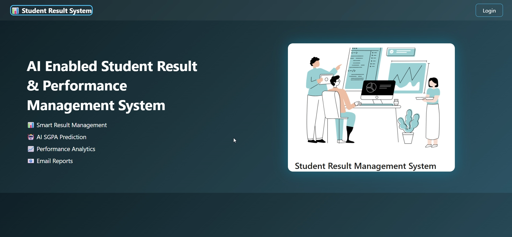

## 🔐 2. Login Selection

Users can choose between the available login options.

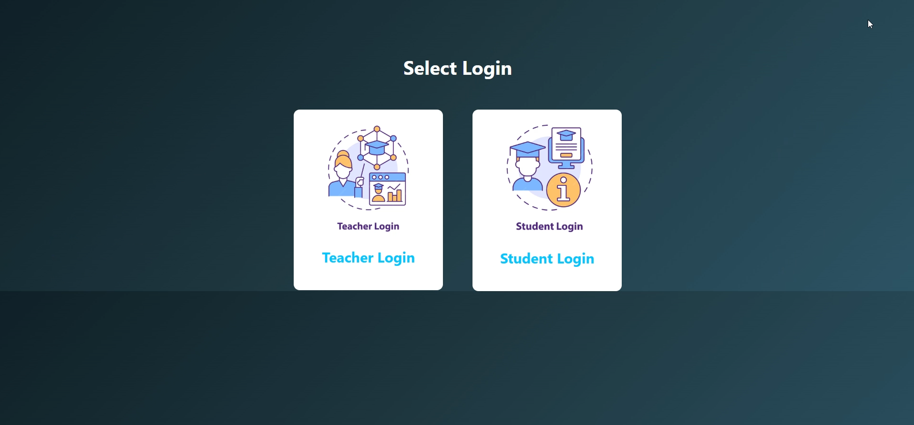

## 👨‍🏫 3. Teacher Login

The Teacher/Admin login page allows authorized users to access the teacher module.

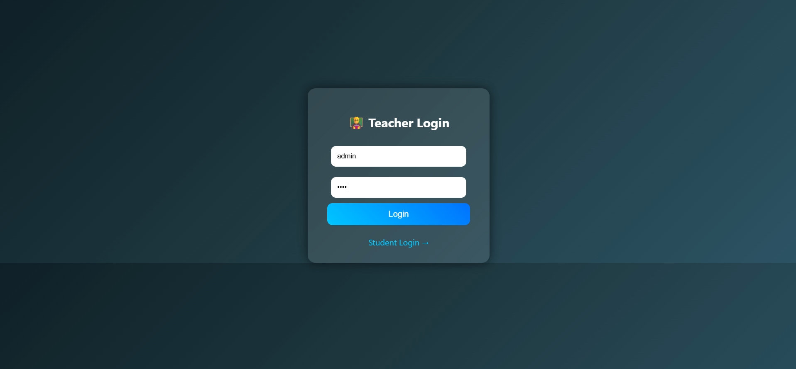

## 👨‍🏫 4. Teacher Dashboard

The Teacher Dashboard provides access to student and result management functionality.

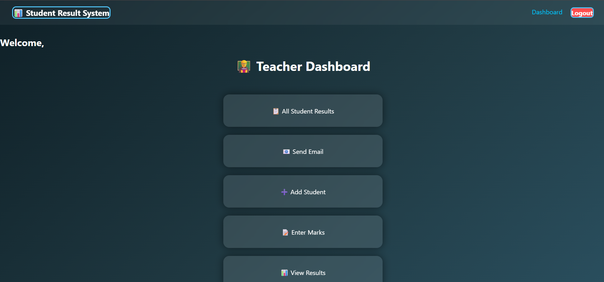

## 📝 5. Subject-wise Marks Entry

Teachers can enter student marks subject by subject through the marks management interface.

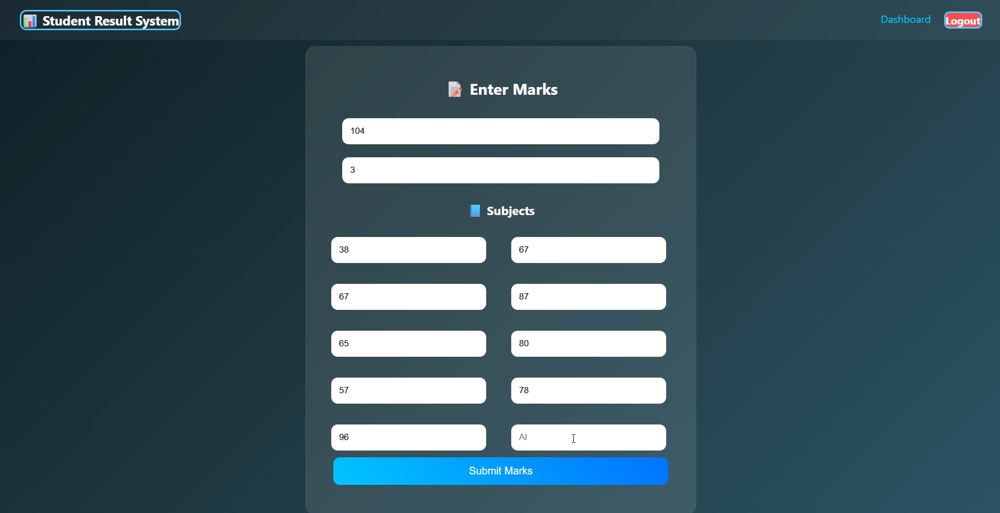

## 📄 6. Calculated Result & Export Options

After entering marks, the system displays the calculated result and provides options to download the result and export data to Excel.

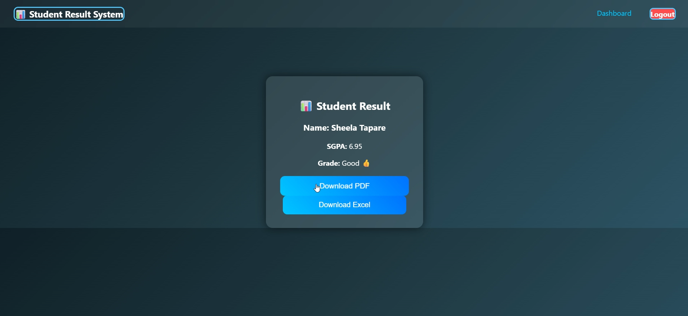

## 👨‍🎓 7. Student Login

Students can log in using their credentials to access their academic information.

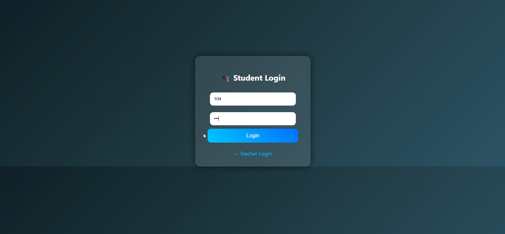

## 👨‍🎓 8. Student Dashboard

The Student Dashboard provides access to results, performance analysis, and other available academic features.

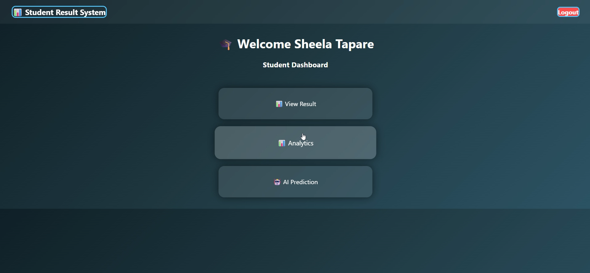

## 📈 9. Performance Analysis

The Performance Analysis section provides different visualization options for understanding academic performance.

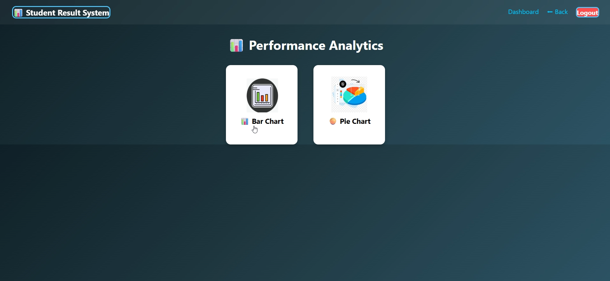

## 📊 10. Bar Chart

The bar chart provides a visual representation of the student's academic performance.

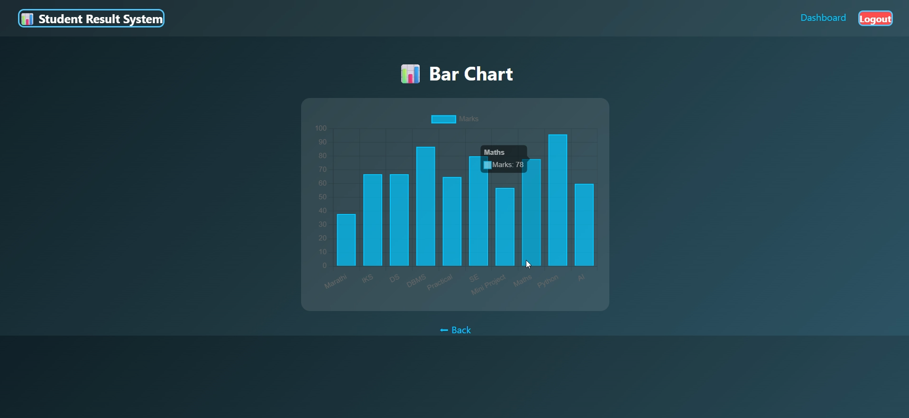

## 🥧 11. Pie Chart

The pie chart provides an alternative visualization of the student's performance data.

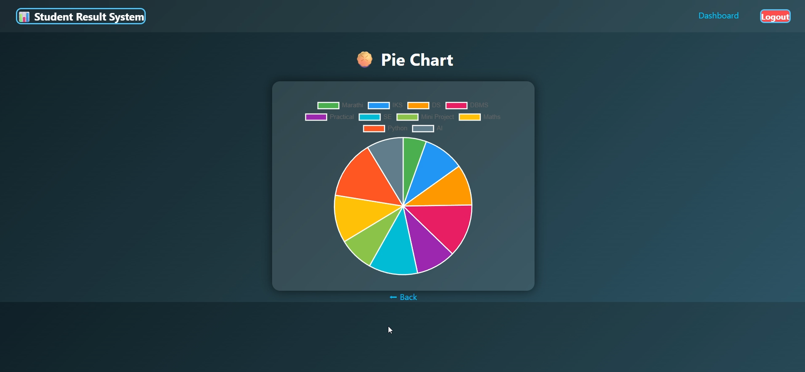

## 🤖 12. Rule-based Academic Prediction

The prediction page provides an academic prediction based on predefined rules and the student's current performance.

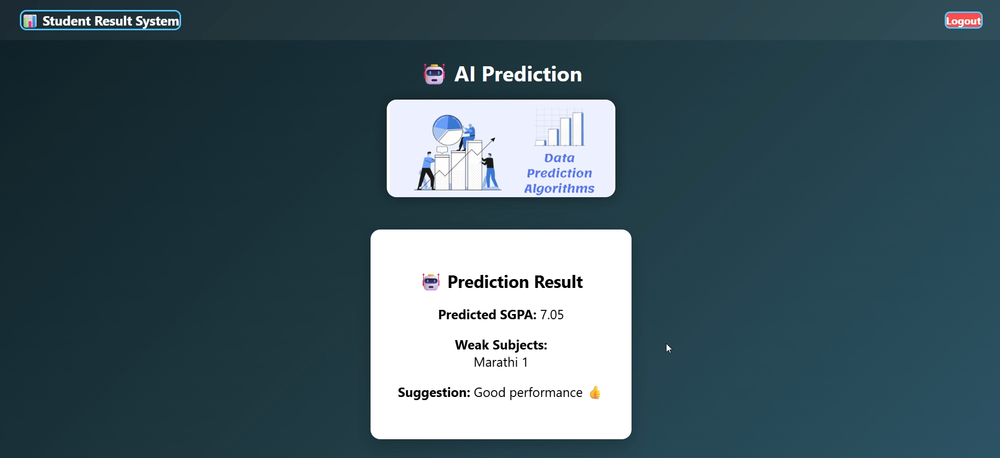
⸻

🛠️ Technologies Used

Technology	Purpose
🐍 Python	Application logic and backend programming
🌐 Flask	Web application framework
🗄️ SQLite	Database management
HTML5	Web page structure
CSS3	User interface and styling
JavaScript	Interactive functionality
📊 Data Visualization	Academic performance charts
📄 Report Generation	Result download
📑 Excel Export	Result/data export

⸻

⚙️ How to Run the Project

1. Clone the Repository

git clone https://github.com/shivangitapare3/ResultHub.git

2. Open the Project Folder

cd ResultHub

3. Create a Virtual Environment

For Windows:

python -m venv venv

Activate it:

venv\Scripts\activate

4. Install Dependencies

If the project contains a requirements.txt file:

pip install -r requirements.txt

Otherwise, install the libraries required by the project.

5. Run the Flask Application

python app.py

6. Open in Browser

Visit:

http://127.0.0.1:5000/

⸻

📁 Project Structure

ResultHub/
│
├── app.py
├── templates/
├── static/
├── screenshots/
│   ├── 01-main-dashboard.png
│   ├── 02-login-selection.png
│   ├── 03-teacher-login.png
│   ├── 04-teacher-dashboard.png
│   ├── 05-marks-entry.png
│   ├── 06-calculated-result.png
│   ├── 07-student-login.png
│   ├── 08-student-dashboard.png
│   ├── 09-performance-analysis.png
│   ├── 10-bar-chart.png
│   ├── 11-pie-chart.png
│   └── 12-ai-prediction.png
│
└── README.md

The exact project structure may vary depending on the files included in the repository.

⸻

🚀 Future Scope

ResultHub can be further enhanced with:

* ☁️ Cloud deployment
* 📱 Improved responsive/mobile interface
* 🤖 Machine Learning-based performance prediction
* 📊 More advanced academic analytics
* 📈 Student performance trends over multiple semesters
* 🔐 Improved authentication and security
* 📧 Automated result notifications
* 📑 More customizable report formats
* 👥 Role-based access control

⸻

🎓 Learning Outcomes

Developing ResultHub provided practical experience in:

* Python programming
* Flask web development
* Database management
* HTML, CSS and JavaScript
* Form handling
* Data processing
* Result calculation
* Data visualization
* Report generation
* Excel data export
* Building a complete web-based application

⸻

👤 Author

Shivangi Tapare

GitHub:
https://github.com/shivangitapare3/ResultHub

⸻

⭐ Project

If you find ResultHub interesting, feel free to explore the repository and check out the project implementation.

ResultHub — Making Student Result Management Simpler, More Organized and More Insightful. 🚀
